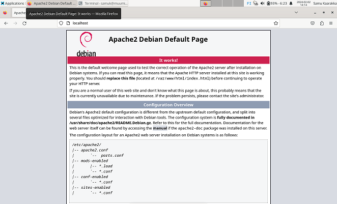
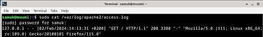
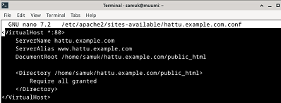

# h3 Hello Web Server

## x) Lue ja tiivistä

### IP-pohjainen virtual host:
-	Jokaisella verkkosivustolla tulee olla oma IP-osoite

### Nimipohjainen virtuaali host:
-	Kätevämpi verrattuna IP-pohjaiseen
-	Useat verkkosivut voivat jakaa saman IP-osoitteen, näin ollen IP-osoitteita säästyy
-	Jokaiselle verkkosivulle määritellään oma verkkotunnus (esim. www.esimerkki1.com, www.esimerkki2.com), jonka jälkeen DNS-palvelin konfiguroidaan niin että kyseiset verkkotunnukset liitetään samaan ip-osoitteeseen
-	Apache http serverissä käytetään VirtualHost-komentoa määrittelemään eri asetukset kullekkin sivustolle

### Lähteet: 
https://httpd.apache.org/docs/2.4/vhosts/name-based.html 
Karvinen, Tero. Name Based Virtual Hosts on Apache – Multiple Websites to Single IP Address. Luettu 02.02.2004. Luettavissa: https://terokarvinen.com/2018/04/10/name-based-virtual-hosts-on-apache-multiple-websites-to-single-ip-address/ 

### A) 
Ensiksi asensin Apache-weppipalvelimen "sudo apt install apache2" komennolla komentorivillä. Seuraavaksi testasin, että weppipalvelimeni vastaa localhost-osoitteesta:

### B)

Seuraavaksi tarkastelin komennolla "cat /var/log/apache2/access.log" lokin rivejä:

* Kohta 1: 127.0.0.1, IP-osoite josta pyyntö tuli
* Kohta 2: [02/Feb/2024:14:13:31 +0200]: Aikaleima, kertoo milloin pyyntö tapahtui
* Kohta 3: "GET / HTTP/1.1": Kertoo HTTP-pyynnön tyypin, tässä tapauksessa se oli GET-pyyntö
* Kohta 4: 200: luku "200" tarkoittaa että palvelin käsitteli pyynnön onnistuneesti
* Kohta 5: 3380: Vastauksen koko tavuina
* Kohta 6: "Mozilla/5.0 (X11; Linux x86_64; rv:109.0) Gecko/20100101 Firefox/115.0": Näyttää tiedot selaimesta ja käyttöjärjestelmästä eli tässä tapauksessa selain oli Firefox ja käyttöjärjestelmä Linux

### C) Etusivu uusiksi

Komennolla "$ sudoedit /etc/apache2/sites-available/hattu.example.com.conf" avasin hattu.example.com.conf- tiedoston nanotekstieditorissa sekä lisäsin alla olevan kuvan mukaiset konfiguraatiot tiedostoon:

* 1. <VirtualHost :*80>: Tämä kohta määrittelee virtuaalipalveimen, joka vastaa saapuviin HTTP-pyyntöihin portissa 80
* 2. "ServerName hattu.example.com": Tämä kohta on virtuaalipalvelimen pääasiallinen verkkotunnus
* 3. "ServerAlias www.hattu.example.com": Vaihtoehtoinen verkkotunnus, tämä kohta mahdollistaa sen, että esimerkiksi "www.hattu.example.com" sekä "hattu.example.com" osoittavat samaan verkkosivustoon

Tärkeää oli myös "Require all granted" tiedoston konfiguraatioon, jotta kaikki käyttäjille sallitaan pääsy.

